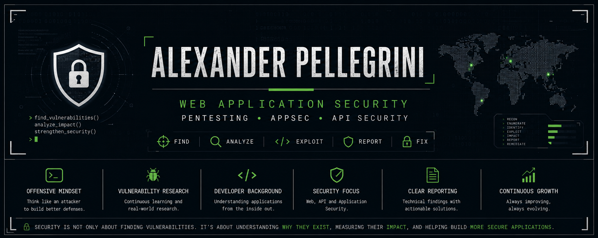

<p align="center">
  
</p>

<h1 align="center">👋 Hi, I'm Alexander Pellegrini</h1>

<h3 align="center">
  Application Security & Web/API Security | Full Stack Developer
</h3>

<p align="center">
  <a href="https://www.linkedin.com/in/alexander-pellegrini/">LinkedIn</a>
  ·
  <a href="https://alexpelle424.github.io/Portafolio/">Portfolio</a>
  ·
  <a href="mailto:alexanderpellegrini424@example.com">Contact</a>
</p>

---

## 🛡️ About Me

I'm a Full Stack Developer and Application Security practitioner focused on **Web Application Security, API Security, and Vulnerability Research**.

My development background allows me to approach security from both sides: understanding how applications are designed and built, and how they can be attacked.

I focus on identifying vulnerabilities, understanding their root causes, assessing their real-world impact, and providing practical remediation guidance.

My goal is not only to find security issues, but to understand **why they exist, how they can be exploited, what they mean for the application and its users, and how they can be fixed**.

---

## 🔐 What I Do

I focus on security assessments and research involving web applications and APIs, with an emphasis on vulnerabilities that can have meaningful security and business impact.

### Security Assessments

* Web Application Security Testing
* API Security Testing
* Authentication & Authorization Testing
* Access Control & IDOR / BOLA Testing
* Session Management Testing
* Business Logic Testing
* Input Validation Testing
* Vulnerability Assessment
* Security Retesting

### Security Deliverables

* Technical Security Reports
* Vulnerability Documentation
* Risk Assessment
* Impact Analysis
* Remediation Recommendations
* Retesting and Validation

My approach is focused on providing findings that are technically accurate, understandable, and actionable for development and engineering teams.

---

## 🏆 Vulnerability Research & Bug Bounty

I actively participate in vulnerability research and bug bounty programs, primarily focusing on web applications and APIs.

My experience includes identifying and responsibly reporting security vulnerabilities within authorized programs, as well as analyzing real-world application security issues and their underlying causes.

This experience complements my background in software development and allows me to approach security testing from both an **offensive** and **application-aware** perspective.

I follow responsible disclosure practices and respect the rules and scope defined by each security program.

> ⚠️ All security research and testing documented here is performed within authorized scopes, bug bounty programs, controlled laboratories, or environments where explicit permission has been granted.

---

## 🎯 Security Focus

My primary areas of interest include:

* 🌐 Web Application Security
* 🔌 REST API Security
* 🔑 Authentication & Authorization
* 🛂 Access Control & IDOR / BOLA
* 🧠 Business Logic Vulnerabilities
* 💉 SQL Injection
* 📜 Cross-Site Scripting (XSS)
* 🔄 Cross-Site Request Forgery (CSRF)
* 🌍 Server-Side Request Forgery (SSRF)
* 🔎 Vulnerability Research
* 📝 Security Reporting & Remediation
* 🛡️ Secure Application Development

---

## 🧰 Technical Skills

### 🌐 Web Development


### 🐍 Programming


### 🗄️ Databases


### 🛡️ Security


**Security capabilities:**

* Web Application Security Testing
* API Security Testing
* Authentication Testing
* Authorization & Access Control Testing
* Business Logic Testing
* Vulnerability Assessment
* OWASP Security Testing
* Security Reporting
* Remediation Recommendations

---

## 🔬 Security Research

I use this space to document technical research, experiments, security labs, and application security topics.

### Research Topics

* 🔑 Authentication
* 🛂 Authorization
* 🚪 Access Control
* 🔌 API Security
* 💉 SQL Injection
* 📜 Cross-Site Scripting
* 🌍 SSRF
* 🧠 Business Logic
* 🔎 Vulnerability Analysis
* 🛡️ Secure Development
* ⚙️ Application Security

Research published here is intended for educational and authorized security testing purposes.

---

## 🚀 Featured Projects

### 🔬 Web Security Research

A collection of technical research and write-ups focused on web application and API security.

**Topics include:**

`Authentication` `Authorization` `API Security` `SQL Injection` `XSS` `SSRF` `Business Logic`

➡️ **[View Repository](#)**

---

### 🧪 Vulnerable Web Application Lab

A deliberately vulnerable web application designed for educational purposes and controlled security testing.

The project explores vulnerabilities from both the **developer** and **attacker** perspectives, demonstrating how insecure implementation decisions can lead to exploitable security issues.

**Technologies:**

`PHP` `JavaScript` `MySQL` `REST API`

➡️ **[View Repository](#)**

---

### 🛠️ Security Tools

A collection of security-oriented tools and scripts developed for educational purposes and authorized security testing.

**Technologies:**

`Python` `Bash` `Linux`

➡️ **[View Repository](#)**

---

## 💻 Development Background

My background in software development includes building:

* 🌐 Full Stack Applications
* 🔌 REST APIs
* 🏗️ MVC-based Systems
* 🗄️ Database-driven Applications
* ⚙️ Web Solutions

This experience helps me understand:

* Application Architecture
* Client-Server Communication
* HTTP Requests & Responses
* Authentication Flows
* Authorization Mechanisms
* Database Interactions
* API Design
* Common Security Implementation Mistakes

I use this knowledge to approach application security from an **application-aware perspective**, connecting vulnerabilities to the underlying code, architecture, and business logic that caused them.

---

## 🔎 Security Testing Approach

My approach to security testing focuses on understanding the application, identifying its attack surface, validating security issues, assessing their impact, and providing actionable remediation guidance.

```text
01 ─ Scope Definition
        ↓
02 ─ Information Gathering
        ↓
03 ─ Attack Surface Mapping
        ↓
04 ─ Authentication Testing
        ↓
05 ─ Authorization Testing
        ↓
06 ─ Session Management
        ↓
07 ─ Input Validation
        ↓
08 ─ API Security Testing
        ↓
09 ─ Business Logic Testing
        ↓
10 ─ Vulnerability Validation
        ↓
11 ─ Risk & Impact Assessment
        ↓
12 ─ Technical Reporting
        ↓
13 ─ Remediation Recommendations
        ↓
14 ─ Retesting & Validation
```

The goal is to provide more than a list of vulnerabilities.

A security assessment should help answer:

* What is the vulnerability?
* Why does it exist?
* How can it be exploited?
* What is the potential impact?
* How should it be remediated?
* Has the remediation been successfully implemented?

---

## 📚 Continuous Learning & Research

I continuously deepen my knowledge in:

* Advanced Web Application Security
* API Security
* Business Logic Vulnerabilities
* Authentication & Authorization
* Access Control
* Application Security
* Secure Software Development
* Vulnerability Research
* Penetration Testing Methodologies

---

## 📊 GitHub Activity

<!-- GitHub statistics can be added as the profile grows -->

---

## 🌐 Connect With Me

💼 **LinkedIn:** [Alexander Pellegrini](https://www.linkedin.com/in/alexander-pellegrini/)

🔗 **Portfolio:** [alexpelle424.github.io/Portafolio](https://alexpelle424.github.io/Portafolio/)

📧 **Email:** [Contact Me](mailto:alexanderpellegrini424@example.com)

---

### 🛡️ Security is not only about finding vulnerabilities.

### It's about understanding why they exist, measuring their impact, and helping build more secure applications.
